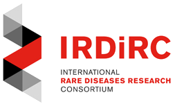
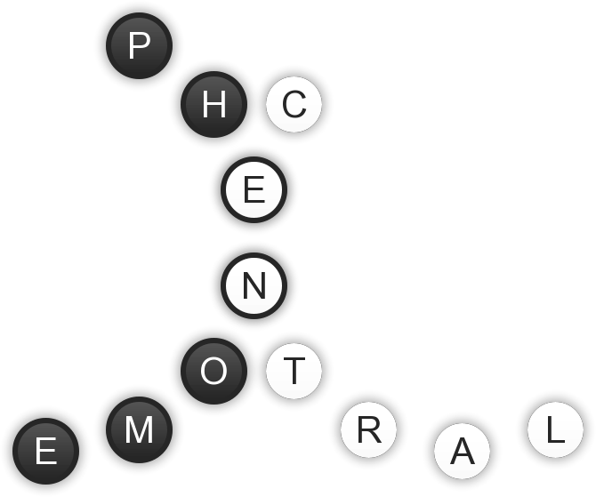
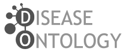

#### Goals

- Integrate, align, and re-distribute cross-species gene, genotype, variant, disease, and phenotype data
- Provide a portal for exploration of phenotype-based similarity
- Facilitate identification of animal models of human disease through phenotypic similarity
- Enable quantitative comparison of cross-species phenotypes
- Develop embeddable widgets for data exploration
- Influence genotype and phenotype reporting standards
- Improve ontologies to better curate genotype-phenotype data

Our philosophy is based on the premise that we want to *make all the data count*. Monarch isn’t just another database that slurps data from the typical places and renders it in a different format. We are driven to truly *integrate* biological information using semantics, and present it in a novel way, leveraging phenotypes to bridge the knowledge gap. Our niche is the use of computational reasoning to enable phenotype comparison both within and across species, with the ultimate goal of improving biomedical research.

#### Background

It is well-known that mutations in orthologous genes and genes in the same signaling pathway often manifest in similar phenotypes, and therefore study of variant phenotypes in model systems may provide insight into human gene function and understanding of disease. For example, mutations in [PAX6](/gene/NCBIGene:5080), which gives rise to the condition [Aniridia](/disease/OMIM:106210) with striking eye phenotypes, also cause eye phenotypic abnormalities in mouse, zebrafish, and flies, including [abnormal lenses](/phenotype/HP_0000517), [underdeveloped](/phenotype/HP_0000517) or even [absent eyes](/phenotype/MP_0001286).

<figure class="right">
  
  <figcaption>

Fig 1. Comparison of PAX6 abnormal phenotypes in human and model organism eyes. (Image from [Washington et al, 2009](http://www.plosbiology.org/article/info%3Adoi%2F10.1371%2Fjournal.pbio.1000247))

  </figcaption>
</figure>

Traditionally, basic researchers and clinical geneticists have searched for and integrated this knowledge manually. However, with the rapid rise in output of genomic sequencing technologies and high-throughput phenotyping efforts, manual identification, integration, and evaluation of relevant phenotype data will quickly become intractable. Even with the rise of biomedical and model organism databases, relevant data is often difficult to find because it remains in disconnected information silos. Even when it is found, such data might be difficult to interpret, requiring domain knowledge of each species’ genetics, development, and even the specialized vocabulary used to describe anatomy, phenotype, and genotype. Furthermore, each organism is best suited for study of different biological phenomena, meaning an integrated view over all organisms is best for seeing relevance to human disease. However, unlike sequence comparison, there is a deficiency of tools that enable quantitative comparison and evaluation of qualitative data for cross-species phenotypes in a centralized location. The Monarch Initiative has set out to fill this need.

Starting in 2009, we published several proof-of-concept experiments that described how phenotypes captured with semantic descriptions (ontologies), together with anatomical mappings between organisms, would provide the means to enable comparison of phenotypes across species, even when the genetic basis for those phenotypes was unknown [Washington et al, 2009](http://www.plosbiology.org/article/info%3Adoi%2F10.1371%2Fjournal.pbio.1000247). Furthermore, initial work on the [Human Phenotype Ontology](http://human-phenotype-ontology.org) demonstrated that similar methods could be employed to assist with differential diagnosis in order to identify the best candidate disease to explain a patient’s clinical features [Kohler et al 2009](http://www.sciencedirect.com/science/article/pii/S0002929709003991).

<figure class="left">
  
  <figcaption>

Fig 2. Phenotypes in human patients and animal models can be computationally compared and evaluated despite being recorded using different vocabularies. These types of comparisons can aid identification of causitive variants during exome analysis, even when human mutations may not have been previously identified. Here, we demonstrate the phenotypes in common between [Pfeiffer Syndrome](/disease/OMIM:101600) and mouse model [CD1.Cg-Fgfr2(tm4Lni)/H ](/genotype/MGI:3053578). (Image from [Robinson et al, 2014](http://genome.cshlp.org/content/24/2/340.short).)

  </figcaption>
</figure>

Today, these same methods are getting used in the clinic, for aiding diagnosis of both known and unknown diseases. [PhenIX](http://compbio.charite.de/PhenIX/) is an exome analysis tool, that utilizes phenotypic similarity of diseases associated with the genes harboring candidate variants to the phenotypic profile of the individual being investigated. It is actively being used in the clinic to help solve difficult-to-diagnose cases ([Zemojtel et al 2014](http://stm.sciencemag.org/content/6/252/252ra123.abstract)).
[Exomiser](http://monarch-exomiser-web-dev.monarchinitiative.org/exomiser) utilizes both human and model organism data as well as interactome data to assist prioritization of candidate variants for the extremely rare disease cases of the NIH Intermural Undiagnosed Disease Program. The same data and methods that underlie PhenIX and Exomiser are available in the Monarch Initiative for your investigation.

Model systems are the cornerstone of biomedical research for understanding of biological processes, testing gene-based disease hypotheses, and developing and testing disease treatments. With the Monarch Initiative, we are providing new tools for the biomedical researcher’s toolbox to explore the landscape of interrelated phenotype data, evaluate qualitative similarities, and generate novel hypotheses within and between species.

#### The Monarch Data Flow

##### Data Sources

As with most biomedical databases, the first step is to identify relevant data from the research community. The Monarch Initiative is focused primarily on phenotype-related resources. We bring in data associated with those phenotypes so that our users can begin to make connections among other biological entities of interest, such as:

- genes
- genotypes
- gene variants (including SNPs, SNVs, QTLs, CNVs, and other rearrangements big and small)
- models (including cell lines, animal strains, species, breeds, as well as targeted mutants)
- pathways
- orthologs
- phenotypes
- publications

##### Data modeling, transformation, and curation

We import data from a variety of data sources in formats including databases, spreadsheets, delimited text files, XML, JSON, and Web APIs, on a continual basis. Our curation team semantically maps each resource into our data model, primarily using ontologies. This involves both typing relevant columns, mappings between columns (such as between identifier and labels, but also more complex associations, such as between a genotype-phenotype association and the publication it was mentioned in), and value-level mapping. Because our focus is on genotype-phenotype data, we focus our efforts on ensuring that each resource’s variants, genes, genotypes, strains, and phenotypes are well-typed using ontologies and standardized identifiers. Internally, we map all genes to [NCBI gene](http://www.ncbi.nlm.nih.gov/gene/) identifiers, diseases to the [Disease Ontology](http://www.diseaseontology.org), and phenotypes into our unified phenotype ontology, [Upheno](https://github.com/obophenotype/upheno). With many resources integrated into a single database, we can join across the various data sources to produce integrated views. We have started with the big players including ClinVar and OMIM, but are equally interested in boutique databases (which you will see more of in the coming months). You can learn more about the sources of data that populate our system from our [sources](/about/sources) page.

<figure class="center">
  
  <figcaption class="center">

Fig 3. The Monarch Initiative data workflow.

  </figcaption>
</figure>

Once curated, we generate views and semantically index them into a Solr instance, and the data is served via REST services. That way when a user is interested in exploring [abnormalities of the ear](/phenotype/HP:0000598), a single query can retrieve all relevant data from the system.

Since all of our data is curated using ontologies, we are currently using SciGraph, a graph database (based on Neo4j) to serve up all our data and ontologies. This has the side benefit of providing the community our semantically mapped data in RDF.

##### Ontologies

For the Monarch system to work, we rely on and contribute to community-developed ontologies to describe the biological entities in the system, including:

- <b>Anatomy:</b> We utilize a variety of species-specific anatomy ontologies, for example the Zebrafish Anatomy ontology, which are all integrated in the context of the multi-species anatomy ontology [Uberon](http://uberon.org), which covers metazoans. We are working toward interoperating with other species as well (yeast, etc.)
- <b>Disease:</b> We use an aggregated suite of disease definitions from many sources, integrating disease definitions from Online Mendelian Inheritance in Man (OMIM), Orphanet, ClinVar, Decipher, and from the Disease Ontology. Mappings between these different vocabularies originate from those extracted from the above groups, as well as MeSH.
- <b>Phenotype:</b> We actively contribute to the development of the Mammalian Phenotype and Human Phenotype ontologies (MP and HPO). We have created an integrated phenotype ontology, as described in [Kohler et al (2014)](http://f1000research.com/articles/2-30/v2) that leverages the logic implemented in MP and HPO to support phenotype comparisons across species.
- <b>Everything else:</b> Many of the above ontologies have logical definitions based on other ontologies, including the CL, GO, ChEBI, SO, .... (For example, ‘Abetalipoproteinemia’ which is defined as blood lacking CHEBI:low density lipoprotein) We are also developing a genotype ontology to support linking phenotypes to different components of the genotype.

These ontologies are merged into monarch.owl, and used to drive the system.

##### Semantic Similarity

Once data has been ingested and transformed as above, it is ready for loading into our semantic similarity engine. [OWLSim](http://www.owlsim.org/) enables search, comparison, and analysis of semantic annotations between entities (genes, genotypes, diseases, etc.), leveraging ontologies and computational reasoners. In the case of Monarch, we currently utilize OWLSim for analysis of collections of abnormal phenotypes attributed to genes, genotypes, variants, and diseases. OWLSim is what computes the similarity values in the phenogrid, annotation sufficiency scores for each entity, and provides the engine behind the [Analyze](https://monarchinitiative.org/analyze/phenotypes/) and Compare functions. The scores are based on a hybrid model of information content (IC) and Jaccard, further described in [Smedley et al (2013)](http://database.oxfordjournals.org/content/2013/bat025.long). We are currently working on new algorithms that will allow consideration of both abnormal and remarkably normal (NOT abnormal) phenotypes when searching and comparing collections of phenotypes.

##### Analysis

<figure class="right" href="#fig4">
  
  <figcaption>

Fig 4. Availability of curated phenotypes (black) attributed to human genes (direct or inferred via orthology) across a range of model organisms (Hs, Homo sapiens; Mm, Mus musculus; Rn, Rattus norvegius; Dr, Danio rerio; Ce, Ceanorabditis elegans). Merge shows the overall representation of phenotypes to unique human genes, where at least one organism contriubtes phenotypes. Model organisms may account for at least half of the overall phenotypic knowledge to understand human gene function. (Data as of March 2014.)

  </figcaption>
</figure>

Given the integrated data sources, and their semantic mappings, we can start to do broad analysis of the data landscape. For example, we have found that while &lt;40% of human genes have been linked to phenotypes either directly, via GWAS studies, or inferred through disease associations, there is &gt;75% coverage (via orthology) when you expand to the five most-typically studied model organisms ([Fig 4](#fig4)). As we expand our database to include other organisms, this is sure to rise.

We can also confirm what we have known for a long time, which is that different model organisms are used to study different areas of biology.

#### Collaborations and Partners

We are proud to work with several organizations to develop ontologies, drive community standards, research rare disease, and influence publishers and the research community to make research results more identifiable and reproducible, including:

| | | |
|:---|:---:|---:|
|  |  |  |
|  |  |  |
|  |  | 

<!--
<table class="collab-table">
  <tr>
    <td></td>
    <td></td>
    <td></td>
  </tr>
  <tr>
    <td></td>
    <td></td>
    <td></td>
  </tr>
  <tr>
    <td></td>
    <td></td>
    <td></td>
  </tr>
</table> -->

<about-footer></about-footer>

